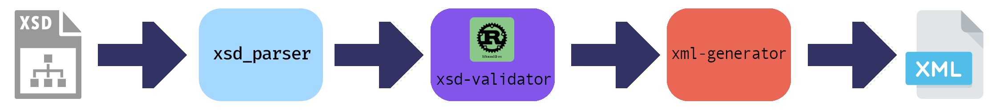

# The Remarkable Depths of the XML Rabbit-Hole

_Zack M Williams, 31st July 2026_

A while ago, I was trying to write tests for the [OpenBusAPI][openbusapi], when need to use some XML input for the test.
The XML file used in the main application is large, so I was hoping to use a shorter one.
After realising that manually editing the XML would be a pain, I wondered whether there was some Python library to generate fake XML that could be used for testing.
After discovering that this wasn't the case, I decided to make my own Python library, which led me down a very deep rabbit hole from which escape may be a problem.

## An XML Generator

Before writing a single line of code for any purpose, always check whether some one has already done it before.
This is one of the most important lessons in coding, not only because it saves time and energy (in principle), the other person has probably created a more efficient implementation than I could.

Usually, I expect that common coding problems have been solved and an open-source implementation widely available.
Sadly, this is not always true, or is only true in a certain language.

If you search for "generate XML file from XSD", usually the first thing that comes up is [Liquid XML][liquidxml] or tools built in to popular IDEs.
However, no libraries or applications.
Open-source tools such as the [Jakarta XML Binding (JAXB)][jaxb] or [xsd2xml][xsd2xml] exist, but both are implemented in Java.

I decided that I would make one myself.

## Oxidising Python

After briefly starting to write a pure Python implementation, I became interested in writing the library in Rust and providing Python bindings.
I had been looking to write a library in Rust for sometime.
I had made a couple of small Rust programs and followed the [Rustlings course][rustlings]
to help learn Rust and was keen to work on a bigger project.

I was aware of several Python libraries written in Rust but I wondered whether wrapping one in the other may still be a problem.
Libraries such as [Polars][polars] use the [PyO3][pyo3] bindings, which I have found relatively easy to use with good documentation.

## XMLGenerator

_Image showing the flow of logic in the XMLGenerator library._

So I created the [XMLGenerator package][xmlgenerator], the package works in three steps:

- Load a schema
- Validate it
- Generate XML output

### XSD Parsing

Multiple schema types for XML exist, such as DTD, XSD, or RELAX NG.
I decided to use XML Schema (XSD) as it is seemingly the standard.

There is a Rust library, [xsd-parser][xsd-parser], for parsing XSD files.
However, the primary purpose of the library is to generate Rust datatypes from the XSD input.
I therefore only used the parser rather than the full library.
Since the purpose of the library is to build Rust types, the validation done with this goal, in mind.
Rather than a more complete validation of the input when parsing the document.

I quickly found that attempting to generate XML instances directly from the schema data produced by this library resulted in multiple errors due to invalid input XSD.
I therefore realised that I would have to perform my own validation on the input files.

### XSD-Validator

The result was the XSD validator crate.
I could not find any Rust library that validated XSD files explicitly, so instead I turned to another language.
My research continually lead to the [libxml2][libxml2] C library, which provides functionality for XML parsing and validation.
It includes functionality for validating an XSD file.
I therefore created Rust bindings for this library, implemented in the [libxml2-rs repo][libxml2-rs].
The XSDValidator crate wraps this functionality and returns whether or not a given input is valid.

However, multiple issues still arose from invalid input files.
The most obvious of these is that infinite loops are not flagged as invalid.
Therefore, if a schema references a child element which contains the initial parent then any generator would attempt to generate these and become stuck in an infinite loop without further intervention.

I therefore added a tracker and recursion checker to test for this behaviour.

### Testing

At this point I should probably mention the testing criteria I am using to check the validate the crates.
I initially wrote some small example files to check the most obvious issues, but I knew that these would not be enough to check all features.
I therefore added the XSDTestData crate to download the [W3C XML test sets][xml-test-sets].
This database contains XSD files from several companies, both valid and invalid.  
However, several of the files marked invalid were validated by [libxml2][libxml2] and several files marked valid were found to be invalid by libxml2.

### XML-Generator

The XML generator converts the XML Schema to an XML instance.
It identifies elements, namespaces, datatypes, and version of the input file and attempts to find the root element.
Once it identifies the root element, it generates an instance of it and all its descendants.

#### Another Can of Worms: Regex and XSD patterns

The XSD specification uses a form of regular expression called an `xs:pattern` to restrict the values of certain fields.
Rust has a [regex crate][regex-rust] for handling regular expressions.

Regular expressions (Regex) are expressions used for matching patterns in text.
Despite being around for a long time, they are not standardised, and there are several "flavours".
Most basic expressions are supported by multiple flavours, though they do not always translate to the same thing.
Each flavour has its own subtle (and also not so subtle) differences from others.

The Rust regex crate uses expressions not supported by XSD and vice versa.
The result of this is that much of the Rust Regex ecosystem is incompatible with XSD patterns.

### Regex Translator

The incompatibility between XSD patterns and Rust Regex means that there are two options:

1. Use XSD Patterns throughout and ignore Rust's regex support
2. Translate the input pattern to Rust's Regex syntax

The first one sounds simple, but would mean having to implement a lot of functionality, it was therefore easier to create a translation module.

Rust does have a crate [regexml][regexml] that implements a XSD compliant regex engine.
This is used to validate the input (XML) regex.
The translator then converts the expression into "standard Rust" Regex, and validated using the
[regex][regex-rust] crate.

The resulting regex expression is often long, since shortcuts are expanded into more explicit classes, however, it is more or less universal.

### Generating values

Now that we've got all regular expressions translated into a single dialect, the rest should be easy... or not!
In order to generate values from regex patterns, I have used the [rand-regex][rand-regex] crate.
This was another reason why the having the expressions in Rust-form was more desirable.
There are several issues here:

1. The truly epic nature of unicode
2. Multiple constraints
3. Constaints that cannot be expressed using regex

Firstly, consider the pattern `\w+`, someone inexperienced with regex may write this to mean [A-Za-z] for most english words.
In many regex flavours, such as JavaScript or PHP, the `\w` "word" character translates to `[A-Za-z0-9_]`.
However, XSD, Rust, and Python define `\w` to be any Unicode word character.
This widens the scope significantly.
The result is that an item which the author may have intended to be written in basic latin, could end up with a string that not only doesn't make sense,
but where each character is from a different alphabet,
Therefore, I introduced an `ascii` option for the `RegexTranslator` which only
includes ASCII characters in the translation unless thee pattern contains a
component that requires the full unicode set.

Secondly, many types are required to meet multiple constraints.
Both constraints may be express as regular expressions.
Generating strings that match both patterns requires additional consideration.
If there is no intersection between the patterns then the code returns an error.
However, if the intersection exists but the overlap is relatively small, then generating a pattern to match both can take many tries.

Finally, some types use constraints that are not easily expressed using regex.
For example, dates.
Additional restrictions may also by placed on the type, either by the inheritance or by the author of the schema.
These further restrictions may also be in the form of regular expression, or may not.
Accounting for all possibilities is a significant challenge.

## Conclusion

I have created the [xmlgenerator][xmlgenerator] package which can generate XML instances from an XML schema (XSD) file.
However, due to the complexity of the XML schema specification, many of the features have not been implemented.

I have highlighted some of the issues with a complete implementation, including validation rules, non-standard regex patterns, and generating values that comply with several constraints.
A complete generator that works for all features would be a significant undertaking.

I originally started this project assuming that it was a solved problem, for which I had only to import a library.
Instead, I fell down a rabbit-hole of complexity from which I have been trying to escape ever since.
Considering I expected this to be an afternoon project, I dread to think how much time I have put into it.
I am drawing a line under it for now and will possibly come back to it in the future.

At least I've learned a lot about Rust, XML, and interfacing with Python.
I've also figured out how to document both [PyO3][pyo3] and bindings and interface with [Sphinx][sphinx] and [Read _the_ docs][rtd].
I found a [library][rust-sphinx] for integrating Rust documentation with Sphinx.
Overall, like many projects, its what you didn't expect to learn that is most useful.

_Now, get me out of this rabbit hole!_

<!-- Links -->

[openbusapi]: https://github.com/zwill22/OpenBusAPI
[liquidxml]: https://www.liquid-technologies.com/online-xsd-to-xml-converter
[jaxb]: https://github.com/eclipse-ee4j/jaxb-ri
[xsd2xml]: https://github.com/mkris/xsd2xml
[rustlings]: https://rustlings.rust-lang.org/
[pyo3]: https://pyo3.rs/v0.29.0/
[polars]: https://pola.rs/
[xmlgenerator]: https://github.com/zwill22/xmlgenerator
[xsd-parser]: https://crates.io/crates/xsd_parser/
[libxml2]: https://gitlab.gnome.org/GNOME/libxml2
[libxml2-rs]: https://github.com/zwill22/libxml2-rs/
[xml-test-sets]: https://github.com/w3c/xsdtests
[regex-rust]: https://crates.io/crates/regex/
[regexml]: https://crates.io/crates/regexml/
[rand-regex]: https://crates.io/crates/rand_regex
[sphinx]: https://www.sphinx-doc.org/
[rtd]: https://about.readthedocs.com/
[rust-sphinx]: https://sphinxcontrib-rust.readthedocs.io/en/stable/
