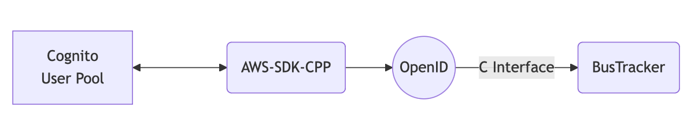
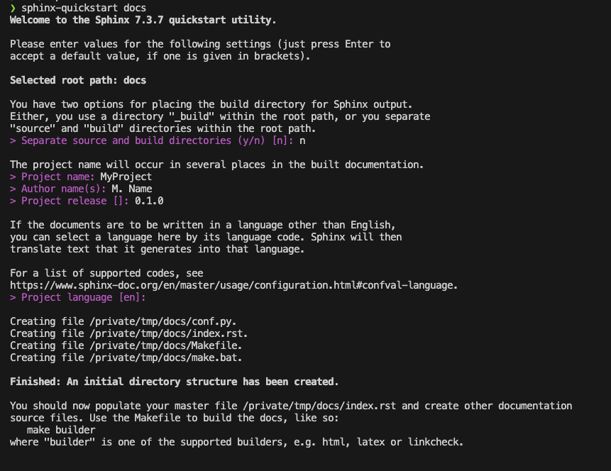
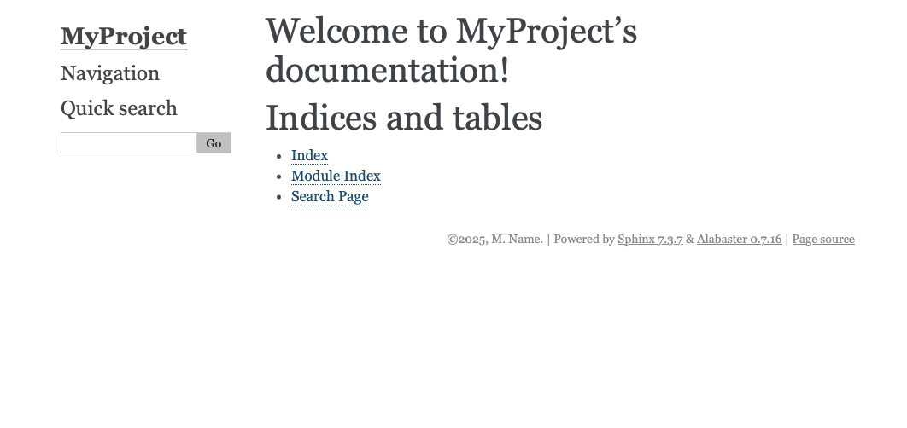

# Breathing and Exhaling: Building documentation for C++ with Doxygen and Sphinx
<!--  -->
*Z. M. Williams - 22nd February 2025*

"Fantastic, I've just finished this extensive project.
Now all I have to do is document it!"
I thought after pushing the latest version of my latest C++ project.

Needless to say, it is not that simple (or is it).
I had previously written documentation for Python and pushed it
to [Read*the*Docs](https://readthedocs.org) with
[Sphinx](https://sphinx-doc.org) and had previously tried to host a
C++ project on the same site but never quite got it to work properly.
I had built the documentation with [Doxygen](https://www.doxygen.nl)
but couldn't get them working together.

Finally I have documentation for three projects up and running.
A Python program, a simple C++ library with a C API,
and a big C++ project. Each of these has been implemented slightly
differently. So I will go through each one individually.

## Python Documentation

Both Sphinx and Read*the*Docs are designed primarly for Python so 
should be easy. Read*the*Docs does have a 
[nice tutorial](https://docs.readthedocs.com/platform/stable/tutorial/index.html)
but it is written assuming you already have the example project setup.

For your own project, to setup the documentation in directory `docs`,from the root directory, run:
```bash
sphinx-quickstart docs/
```
This script will guide you through the options for initialising a 
documentation directory (see image).


*Image showing the steps in the `sphinx-quickstart` script.*

For most of these options the defaults are fine but give the project
a name, an author name, and a version. The script creates four files 
and three empty subdirectories. Of the four files, `Makefile` and
`make.bat` are scripts for building the documentation, `index.rst` is
the "frontpage" of the documentation, and `conf.py` is the Sphinx
configuration. The configuration file `conf.py`, should look 
something like:
```python
# Configuration file for the Sphinx documentation builder.
#
# For the full list of built-in configuration values, see the documentation:
# https://www.sphinx-doc.org/en/master/usage/configuration.html

# -- Project information -----------------------------------------------------
# https://www.sphinx-doc.org/en/master/usage/configuration.html#project-information

project = 'MyProject'
copyright = '2025, M. Name'
author = 'M. Name'
release = '0.1.0'

# -- General configuration ---------------------------------------------------
# https://www.sphinx-doc.org/en/master/usage/configuration.html#general-configuration

extensions = []

templates_path = ['_templates']
exclude_patterns = ['_build', 'Thumbs.db', '.DS_Store']


# -- Options for HTML output -------------------------------------------------
# https://www.sphinx-doc.org/en/master/usage/configuration.html#options-for-html-output

html_theme = 'alabaster'
html_static_path = ['_static']
```
This includes the project details, a list of sphinx extensions,
the templates path, paths to exclude, the theme for building html,
and path for static files to customise the html output. The html
documentation may then be built using
```bash
python -m sphinx -T -b html -d _build/doctrees -D language=en . _html
```
from inside the `docs` directory. This will output the documentation
to the directory `docs/_html`. I recommend adding this to 
`.gitignore` along with `docs/_build`.

To use the Read*the*Docs theme rather than the default, set:
```python
html_theme = ["sphinx_rtd_theme"]
```

As it stands currently, this generates the default documentation:


*Image showing the default documentation with the alabaster theme.*

To customise this, edit the `index.rst` file
```rst
.. MyProject documentation master file, created by
   sphinx-quickstart on Sat Feb 22 14:56:41 2025.
   You can adapt this file completely to your liking, but it should at least
   contain the root `toctree` directive.

Welcome to MyProject's documentation!
=====================================

.. toctree::
   :maxdepth: 2
   :caption: Contents:


Indices and tables
==================

* :ref:`genindex`
* :ref:`modindex`
* :ref:`search`
```
Other files relative to this one may be included by adding their 
relative path to the `Contents:`. It is also possible to include 
other files directly inside this using `.. include:: file`, or
markdown files with
```rst
.. include:: file.md
   :parser: myst_parser.sphinx_
```
which requires the `myst_parser` extension. 

To generate documentation from the code, I recommend `sphinx-apidoc`
which builds the files for each module which may then be linked to.

## C++ Documentation

