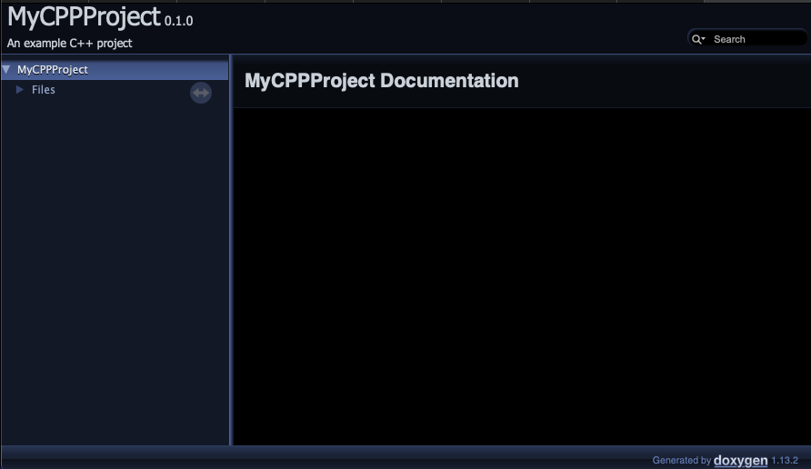
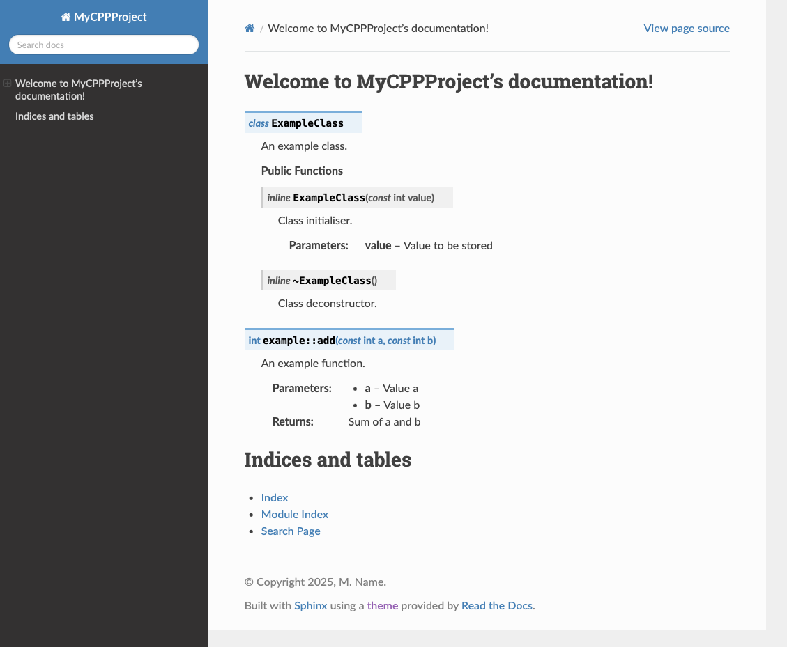
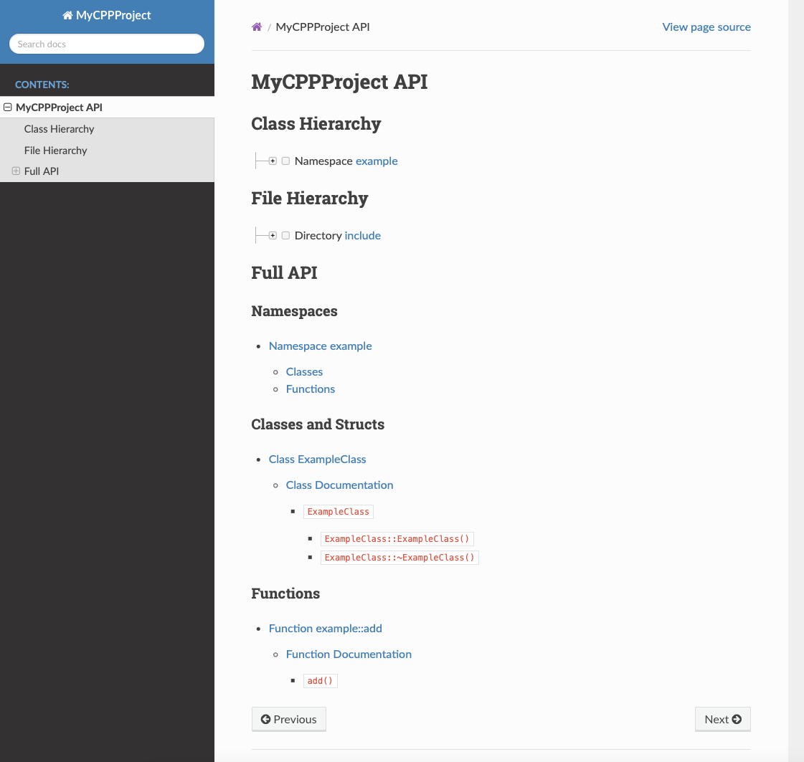

# Breathing and Exhaling: Building documentation for C++ with Doxygen and Sphinx
<!--  -->
*Z. M. Williams - 22nd February 2025*

"Fantastic, I've just finished this extensive project.
Now all I have to do is document it!"
I thought after pushing the latest version of my latest C++ project.

Needless to say, it is not that simple (or is it).
I had previously written documentation for Python and pushed it
to [Read*the*Docs](https://readthedocs.org) with
[Sphinx](https://sphinx-doc.org) and had previously tried to host a
C++ project on the same site but never quite got it to work properly.
I had built the documentation with [Doxygen](https://www.doxygen.nl)
but couldn't get them working together.

Finally I have documentation for three projects up and running.
A Python program, a simple C++ library with a C API,
and a big C++ project. Each of these has been implemented slightly
differently. So I will go through each one individually.

## Python Documentation

Both Sphinx and Read*the*Docs are designed primarly for Python so 
should be easy. Read*the*Docs does have a 
[nice tutorial](https://docs.readthedocs.com/platform/stable/tutorial/index.html)
but it is written assuming you already have the example project setup.

For your own project, to setup the documentation in directory `docs`,from the root directory, run:
```bash
sphinx-quickstart docs/
```
This script will guide you through the options for initialising a 
documentation directory (see image).


*Image showing the steps in the `sphinx-quickstart` script.*

For most of these options the defaults are fine but give the project
a name, an author name, and a version. The script creates four files 
and three empty subdirectories. Of the four files, `Makefile` and
`make.bat` are scripts for building the documentation, `index.rst` is
the "frontpage" of the documentation, and `conf.py` is the Sphinx
configuration. The configuration file `conf.py`, should look 
something like:
```python
# Configuration file for the Sphinx documentation builder.
#
# For the full list of built-in configuration values, see the documentation:
# https://www.sphinx-doc.org/en/master/usage/configuration.html

# -- Project information -----------------------------------------------------
# https://www.sphinx-doc.org/en/master/usage/configuration.html#project-information

project = 'MyProject'
copyright = '2025, M. Name'
author = 'M. Name'
release = '0.1.0'

# -- General configuration ---------------------------------------------------
# https://www.sphinx-doc.org/en/master/usage/configuration.html#general-configuration

extensions = []

templates_path = ['_templates']
exclude_patterns = ['_build', 'Thumbs.db', '.DS_Store']


# -- Options for HTML output -------------------------------------------------
# https://www.sphinx-doc.org/en/master/usage/configuration.html#options-for-html-output

html_theme = 'alabaster'
html_static_path = ['_static']
```
This includes the project details, a list of sphinx extensions,
the templates path, paths to exclude, the theme for building html,
and path for static files to customise the html output. The html
documentation may then be built using
```bash
python -m sphinx -T -b html -d _build/doctrees -D language=en . _html
```
from inside the `docs` directory. This will output the documentation
to the directory `docs/_html`. I recommend adding this to 
`.gitignore` along with `docs/_build`.

To use the Read*the*Docs theme rather than the default, set:
```python
html_theme = ["sphinx_rtd_theme"]
```

As it stands currently, this generates the default documentation:


*Image showing the default documentation with the alabaster theme.*

To customise this, edit the `index.rst` file
```rst
Welcome to MyProject's documentation!
=====================================

.. toctree::
   :maxdepth: 2
   :caption: Contents:


Indices and tables
==================

* :ref:`genindex`
* :ref:`modindex`
* :ref:`search`
```
Other files relative to this one may be included by adding their 
relative path to the `Contents:`. It is also possible to include 
other files directly inside this using `.. include:: file`, or
markdown files with
```rst
.. include:: file.md
   :parser: myst_parser.sphinx_
```
which requires the `myst_parser` extension. 

To generate documentation from the code, I recommend `sphinx-apidoc`
which builds the files for each module which may then be linked to.

## Python Documentation: Deploying to Read*the*Docs

Deploying to Read*the*Docs (RTD) requires a `.readthedocs.yml` file in the
main directory. The standard method is:
```yml
# .readthedocs.yml
version: 2

build:
  os: ubuntu-lts-latest
  tools:
    python: latest

sphinx:
  configuration: docs/conf.py
  fail_on_warning: false

python:
  install:
    - requirements: docs/requirements.txt
```
This tells RTD to use the latest Ubuntu image with the latest Python, to look for the
Sphinx `conf.py` file in `docs/conf.py` and install all requirements in
`docs/requirements.txt` using `pip`. With this setup, the project can be synced to
RTD, for which I recommend
[their tutorial](https://docs.readthedocs.com/platform/stable/tutorial/index.html).

If (like me), you prefer a Conda environment or your project requires packages not
available on pip. Then it is possble to setup `readthedocs.yml` to use 
[Mamba](https://mamba.readthedocs.io) ([Conda](https://docs.conda.io)).
This can be done using:
```yml
# .readthedocs.yml
version: 2

build:
  os: ubuntu-lts-latest
  tools:
    python: "mambaforge-latest"

conda:
  environment: docs/environment.yml

sphinx:
  configuration: docs/conf.py
```
This requires a
[Conda environment file](https://docs.conda.io/projects/conda/en/latest/user-guide/tasks/manage-environments.html#create-env-file-manually)
of the form:
```yml
name: RTDbuild
channels:
 - conda-forge
dependencies:
  - python==3.12
  - sphinx>=4.5.0
  - sphinx-rtd-theme>=1.3.0
```
This method may have more overhead than using `pip` but is useful, particularly for
non-Python projects.

## C++ Documentation: Doxygen

To build documentation for C++, the best tool is Doxygen. Assuming a directory structure
```bash
.
├── CMakeLists.txt
├── README.md
├── docs
├── include
│   └── libexample.hpp
└── src
    └── example.cpp
```
There are a number of ways to use doxygen, such as with CMake. However, the simplest way
is with a `Doxyfile`. To generate this, run
```bash
doxygen -g
```
which creates a file `Doxyfile` in the current directory. This file is nearly 3000
lines long (mostly comments) and contains all the default settings for Doxygen.
The main ones to change are:
```doxyfile
// Doxyfile
PROJECT_NAME           = MyCPPProject
PROJECT_NUMBER         = 0.1.0
PROJECT_BRIEF          = "An example C++ project"
OUTPUT_DIRECTORY       = docs/_doxygen
INPUT                  = src/ include/
GENERATE_XML           = YES
FILE_PATTERNS          = *.hpp *.h
RECURSIVE              = NO
EXCLUDE_PATTERNS       = 
```
Of these, the input and output directories are the most important for generating 
standard doxygen output and must be specified relative to the Doxyfile. The default
version looks for many file patterns but if you only want header files documented,
then other files should be removed. This configuration will search the `src/` and 
`include/` but not subdirectories. Setting `RECURSIVE = YES` will search directories
recursively but `EXCLUDE_PATTERNS` may be needed to exclude directories. 

Once this file is finalised, running
```bash
doxygen Doxyfile
```
will generate the documentation in `docs/_doxygen`. Opening `docs/_doxygen/html/index.html`
will display the documentation index. 


*Example Doxygen index.html.*

## C++ Documentation: Sphinx

Now that the doxygen documentation has been built, it can be included in Sphinx 
documentation. Assuming the Sphinx documentation has been setup as before and the `Doxyfile` as above in `docs`, the project
directory should look like:
```bash
.
├── Doxyfile
├── README.md
├── docs
│   ├── Makefile
│   ├── _build
│   ├── _doxygen
│   ├── _static
│   ├── _templates
│   ├── conf.py
│   ├── index.rst
│   └── make.bat
├── include
│   └── libexample.hpp
└── src
    └── example.cpp
```
To translate the Doxygen to Sphinx requires
[Breathe](https://breathe.readthedocs.io/en/latest/).
Which may be used by modifying the `conf.py` file 
to
```python
project = 'MyCPPProject'
copyright = '2025, M. Name'
author = 'M. Name'
release = '0.1.0'

extensions = [
    "breathe",
    "sphinx_rtd_theme"
]

breathe_projects = {
    "MyCPPProject": "_build/_doxygen/xml/",
}

breathe_default_project = "MyCPPProject"

templates_path = ['_templates']
exclude_patterns = ['_build', 'Thumbs.db', '.DS_Store']

html_theme = "sphinx_rtd_theme"
html_static_path = ['_static']
```
C++ functions, classes, structs, etc. can then be included in the
Sphinx documentation using the various
[Breathe directives](https://breathe.readthedocs.io/en/latest/directives.html).

Consider the header file:
```cpp
// libexample.hpp
#ifndef LIBEXAMPLE_HPP
#define LIBEXAMPLE_HPP

/// @brief An example namespace
namespace example {

/// @brief An example class
class ExampleClass
{
private:
    /// @brief Some private data
    int data;
public:
    /// @brief Class initialiser
    /// @param value Value to be stored
    ExampleClass(const int value) : data(value) {};

    /// @brief Class deconstructor
    ~ExampleClass() {};
};

/// @brief An example function
/// @param a Value a
/// @param b Value b
/// @return Sum of a and b
int add(const int a, const int b) {
    return a+b;
}

}

#endif // LIBEXAMPLE_HPP
```
then these docstrings can be included in the Sphinx
`index.rst` using
```rst
.. doxygenclass:: example::ExampleClass
   :members:

.. doxygenfunction:: example::add
```

Running the Sphinx build command results in:


*Example RTD-style documentation for the above C++ code*

This can then be deployed to Read*the*Docs in the same way as a standard
Python project (above), making sure to include `Breathe` in the project
dependencies. However, the Doxygen command will have to be run before the
Sphinx-build command, this can be added to the workflow by changing the
`build` section in `.readthedocs.yml` to:
```yml
build:
  os: ubuntu-lts-latest
  tools:
    python: latest
  jobs:
    pre_build:
      - doxygen Doxyfile
```
This will build the Doxygen documentation before the predefined `build` command
runs `sphinx`.

## C++ Documentation: Automating with Exhale

Breathe reads in the Doxygen, Exhale outputs it. I'm starting to sense a theme with
these names! Above, we used Breathe to read the Doxygen documentation and used the
provided directives to include the documentation in our files. The
[Exhale package](https://exhale.readthedocs.io) automates the process of
adding the documentation to Sphinx, creating its own files which can be included
in the index.

Install Exhale and add it to the project dependencies list. Then edit the `conf.py`
file to include:
```python
extensions = [
    "breathe",
    "exhale",
    "sphinx_rtd_theme"
]

breathe_projects = {"MyCPPProject": "./_doxygen/xml/"}
breathe_default_project = "MyCPPProject"

exhale_args = {
    # These arguments are required
    "containmentFolder": "./api",
    "rootFileName": "library_root.rst",
    "doxygenStripFromPath": "..",
    "rootFileTitle": "MyCPPProject API",
    # Suggested optional arguments
    "createTreeView": True
}
```
This scans the Doxygen XML documentation in `docs/_doxygen/xml` and generates the
Breathe directives as before. Exhale then uses these to generate new API documentation
in `docs/api`, with the root file `library_root.rst` titled `MyCPPProject API`.

In order to include this generated documentation, simply add `api/library_root` to
the contents list in `index.rst`.


*The MyCPPProject API documentation page generated by Exhale*

## Further Automation

It is also possible to use Exhale to generate the Doxygen documentation itself.
This removes the need for a separate `Doxyfile` and the `pre_build` step in
`.readthedocs.yml`. By setting
```python
exhale_args = {
    "containmentFolder": "./api",
    "rootFileName": "library_root.rst",
    "doxygenStripFromPath": "..",
    "rootFileTitle": "MyCPPProject API",
    "createTreeView": True
    "exhaleExecutesDoxygen": True,
    "exhaleDoxygenStdin": textwrap.dedent("""
    INPUT = ../src/ ../include/
    FILE_PATTERNS = *.hpp *.h
    """)
}
```
Exhale will automatically run the Doxygen build step without the 
`Doxyfile` and place the output in the xml in the directory
where Breathe expects to find the documentation. The command
`exhaleDoxygenStdin` represents the `Doxyfile` and can be used to
edit any argument as previously, though some of reserved by
Exhale (e.g. `OUTPUT_DIRECTORY`).

## Summary

In this guide, we have built documentation for Python with Sphinx,
documentation for C++ with Doxygen, and shown how to use Breathe and
Exhale to get Doxygen documentation into Sphinx so that it can be
uploaded to Read*the*Docs.
