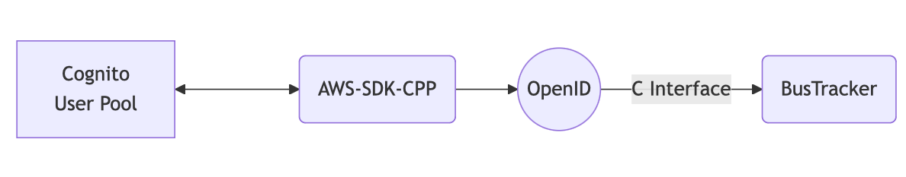

# Building and linking the AWS-SDK-CPP for iOS and simulator

*Z. Williams - 13th December 2024 (Updated 18th December 2024)*

I have recently been trying to create a
[new iOS app to track Bus locations in real-time](https://github.com/zwill22/BusTracker.git).
The location data is taken from the UK's [Bus Open Data Service](https://www.bus-data.dft.gov.uk).
Having managed to get the prototype app to load some bus data directly from this service,
I decided to use an
[AWS API Gateway](https://docs.aws.amazon.com/apigateway/latest/developerguide/welcome.html) 
as the access point to the API. At some point I will write a guide to setting this up as it took 
me a while to figure it out.
I then setup a
[Cognito Identity Pool](https://docs.aws.amazon.com/apigateway/latest/developerguide/apigateway-integrate-with-cognito.html)
to control access to the API.
Now my app needs to request access codes from here which can then be used to call the main API.
My initial thought to implement this was to use the
[AWS-SDK-Swift](https://aws.amazon.com/sdk-for-swift/)
to manage access. This seems like the obvious method.

Firstly, I am not a seasoned Swift developer and this is my first app, and secondly,
the Swift SDK does not appear to be the
most developed of the AWS-SDKs and the documentation is lacking.
I perservered and eventually I was trying to use the documentation
for the other SDKs to find what I needed in the Swift one. Eventually, I decided to use the
[AWS-SDK-CPP](https://aws.amazon.com/developer/language/cpp).
I have a background in C++ development and thought that Swift and C++ interoperability 
was easy to achieve.

## AWS-SDK-CPP for MacOS

My first port of call for this was `conda install aws-sdk-cpp -c conda-forge`,
unfortunately this build does not include the `cognito-idp` module which is needed to 
authenticate users using cognito. 
It does provide a `cognito-identity` module but this seems to be more for managing user pools
rather than using them. To download AWS-SDK-CPP (with its submodules) I used:
```
git clone --recurse-submodules https://github.com/aws/aws-sdk-cpp
```
However, as this is quite a large repository even this has failed for me.
To avoid such a large download, an alternative is:
```
git clone https://github.com/aws/aws-sdk-cpp --depth 1
cd aws-sdk-cpp
git submodule update --init --recursive --depth 1  
```
From inside the `aws-sdk-cpp` directory build and install with:
```
cmake . -DBUILD_ONLY="cognito-idp"
cmake --build . --config=Release
cmake --build . --target install
```
Easy! But I actually need this for iOS and the iOS simulator. I assumed this would be easy,
so got on with my own library.

## The OpenID module

So, I have my [BusTracker app](https://github.com/zwill22/BusTracker.git)
and the AWS-SDK-CPP installed on my Mac.
I decided to write the interface to AWS-SDK-CPP as its own library,
which after many name changes is now the
[OpenID](https://github.com/zwill22/OpenID.git) library.
The original aim behind this was to be able to import it into the BusTracker app 
without having to worry about including the AWS-SDK-CPP library directly.

This library is pure C++ but I also provide an optional C header which is built using:
```
cmake . -DC_INTERFACE=ON
cmake --build .
```
For this I would like to acknowledge a
[brilliant article](https://medium.com/@JMangia/swift-swift-c-c-stl-9e620e471145),
for helping me write the interface.
Having completed this library all that I needed to do was include it in the BusTracker app.
Well surely that is simple?

## Building CMake libraries for iOS and simulator

I expected this to be a flag in cmake but no such luck. 
Firstly, after much research and head-scratching, I found that
a toolchain file is helpful in this situation. For this I found the
[iOS-CMake Library](https://github.com/leetal/ios-cmake.git)
which is a fork of an earlier library of the same name. This library recommends building using
```
cmake -B build -G Xcode -DCMAKE_TOOLCHAIN_FILE=${IOSCMAKE_DIR}/ios.toolchain.cmake -DPLATFORM=${PLATFORM}
cmake --build build --config Release
```
where `${PLATFORM}` may be one of a number of Apple Platforms.
As I am using an Apple Silicon Mac, the relevent options for me are:
- OS64 - to build for iOS (arm64 only)
- SIMULATORARM64 - to build for iOS simulator 64 bit (arm64)
- VISIONOS - to build for visionOS (arm64) -- Apple Silicon Required
- SIMULATOR_VISIONOS - to build for visionOS Simulator (arm64) -- Apple Silicon Required
- TVOS - to build for tvOS (arm64)
- SIMULATORARM64_TVOS = to build for tvOS Simulator (arm64)
- WATCHOS - to build for watchOS (armv7k, arm64_32)
- SIMULATORARM64_WATCHOS = to build for watchOS Simulator (arm64)
- MAC_ARM64 - to build for macOS on Apple Silicon (arm64)
- MAC_CATALYST_ARM64 - to build iOS for Mac on Apple Silicon (Catalyst, arm64)

However, the library also provides the following options:
- OS64COMBINED - to build for iOS & iOS Simulator (FAT lib) (arm64, x86_64)
- VISIONOSCOMBINED - to build for visionOS & visionOS Simulator (FAT lib) (arm64) -- Apple Silicon Required
- TVOSCOMBINED - to build for tvOS & tvOS Simulator (arm64, x86_64)
- WATCHOSCOMBINED - to build for watchOS & Simulator (armv7k, arm64_32, i386)

These options build FAT libraries which combine the libraries for the device and
the simulator into a single
library. These must be built using the `Xcode` generator and must be installed using 
`cmake --install . --config Release`. 
I attempted to build the `OS64COMBINED` library for AWS-SDK-CPP without success.
However, this builds the library for both arm64 and x86_64 architectures, 
unnessecesary on a Apple Silicon Mac.
Instead, I recommend building the libraries separately and then combining later. 

## Building AWS-SDK-CPP for iOS and Simulator

Following that generic discussion on building libraries for iOS and simulator, 
it seems the work is done. 
In fact, there are a number of other issues when compiling AWS-SDK-CPP for iOS. 
The full cmake configure command that I used in the end, after much trial and error, was:
```
cmake ${AWS_DIR} -DCMAKE_TOOLCHAIN_FILE=${IOS_CMAKE_DIR}/ios.toolchain.cmake -DPLATFORM=${platform} -DBUILD_ONLY="cognito-idp" -G Xcode -DCMAKE_INSTALL_PREFIX=${AWS_BUILD_DIR}/install/${platform} -DUSE_CRT_HTTP_CLIENT=ON -DDEPLOYMENT_TARGET=18.0 -DFORCE_SHARED_CRT=OFF -DBUILD_SHARED_LIBS=OFF -DCPP_STANDARD=17 -DTARGET_ARCH=apple -DHAS_MOUTLINE_ATOMICS=OFF
```
Unpacking these, the first four should be obvious from above. I personally built the library for
`OS64` and `SIMULATORARM64`, using the latest deployment target.
I wanted to build the static version of the library so set `BUILD_SHARED_LIBS=OFF` 
and `FORCE_SHARED_CRT=OFF`.
Additionally, the option `USE_CRT_HTTP_CLIENT=ON` is necessary to avoid a
dependence on `libcurl` and, by extension `libssl`. 
Finally, the option `-DHAS_MOUTLINE_ATOMICS=OFF` is necessary to build with the XCode generator. 
<!-- Recheck implicit conversion problem, PR? -->

In this configuration, the only dependency is `zlib` which is available in the XCode SDKs.
Following this, building and installation are simple using:
```
cmake --build . --config Release
cmake --install . --config Release
```
to install the libraries in directory `${AWS_INSTALL_PREFIX}/${PLATFORM}`. Doing this for both 
platforms should not present a problem.

## Building OpenID for iOS and simulator

Having built AWS-SDK-CPP, two steps remain:
- Building OpenID for iOS and Simulator
- Including the library in BusTracker

Building OpenID is relatively simple, a
[`CMakePresets.json`](https://github.com/zwill22/OpenID/blob/main/CMakePresets.json)
file is included the [OpenID repository](https://github.com/zwill22/OpenID.git)
with configurations `iOSBuild` and `iOSSimulatorBuild`. However, the complete `cmake` configure
commands is
```
cmake . -DCMAKE_TOOLCHAIN_FILE=${IOS_CMAKE_DIR}/ios.toolchain.cmake -DPLATFORM=${PLATFORM} -G Ninja -DCMAKE_INSTALL_PREFIX=${OPENID_INSTALL_PREFIX}/${PLATFORM} -DDEPLOYMENT_TARGET=18. -DAWSSDK_ROOT_DIR=${AWS_INSTALL_PREFIX}/${PLATFORM} -DC_INTERFACE=ON -DUSE_CATCH=OFF -DBUILD_SHARED_LIBS=OFF
```
where `${AWS_INSTALL_PREFIX}/${PLATFORM}` is the location where the AWS-SDK-CPP library for the 
respective platform was installed. 

If OpenID built correctly, there should be two static library files for each
platform, `libOpenID.a`
contains the full OpenID C++ library and `libOpenIDC.a` includes the C interface 
functions. The header file we need is `OpenID.h`,
which is inside the libraries include directory. Having built
these, all that remains is to include these in Xcode.

## Including C++ libraries in a Swift project

Open the XCode project settings, in the "Search paths" section, 
add all header file locations to "Header Search Paths". 


*Image showing the Header Search Paths option in the BusTracker project settings*

In order to include a C header in Swift code, an objective C bridging header is required. To create this navigate to "Create new file from template.." in Xcode and choose "Header file". 


*Image showing the creation of a Header file in XCode*

The file should include all header files to be used in the project, 
for the BusTracker example, this is simple:
```objC
// Bridging header file
#import "OpenID.h"
```
In the case of a header only library, this would be all that is required. For a 
library with pre-built binaries, additional steps are required. The aim is to include 
all neccessary libraries as XCode frameworks, these act as combined libraries for
multiple platforms similar to a FAT library but for platforms rather than
architectures.

## Creating XCFrameworks for OpenID

Assuming the static libraries `libOpenID.a` and `libOpenIDC.a` have been built for
each platform, these may be combined into XCFrameworks using the command
```
xcodebuild -create-xcframework -library ${OPENID_INSTALL_PREFIX}/iphoneosBuild/Release-iphoneos/libOpenID.a -library ${OPENID_INSTALL_PREFIX}/iphonesimulator/Release-iphonesimulator/libOpenID.a -output ${OUTPUT_DIR}/libopenID.xcframework
```
and similarly for `libOpenIDC.a`.

My original aim when creating this project was for the `libOpenIDC.a` to bundle 
all dependencies into a single file. Unfortunately, this is not the case, 
and while this may be possible, the easiest option is to convert each AWS-SDK-CPP
library to an XCFramework using the above method and adding to XCode as a dependency.

## Adding XCFrameworks to XCode

Now that the external dependencies are converted to XCFrameworks the rest is simple. 
Simply navigate to the project's settings choose the settings for the desired target, go to the
"General" tab and find the "Frameworks, Libraries, and Embedded Content" section. 
Choose the `+` icon and add all the libraries to Xcode. 


*Image showing the Frameworks, Libraries, and Embedded Content section in XCode*

At this point I originally thought I was finished. However, after using more of the functions
in OpenID, the app failed to compile. After much head scratching, 
I figured out that it is also necessary to include `zlib` for the `aws-crt-cpp` module.
This can be done easily by choosing the `+` icon again and adding `libz.tbd` to the embedded content
list.


*Image showing `libz.tbd` in the list of Apples SDKs.* 

After this, the app should compile and run. 

## Conclusion

In a continuing effort to create an iOS app with an AWS API Gateway, I have used the
AWS-SDK-CPP to request authentication using the Cognito Identity Provider inside a new
project OpenID. I have built static libraries for both this project
and the SDK for iOS and iOSSimulator on an Apple Silicon Mac.
I have created XCFrameworks for each library and imported them into
Xcode using an objective-C bridging header to expose the C functions to Swift.

The next step is to build the Swift interface for the OpenID library and then use the
authentication results to call the API gateway.
